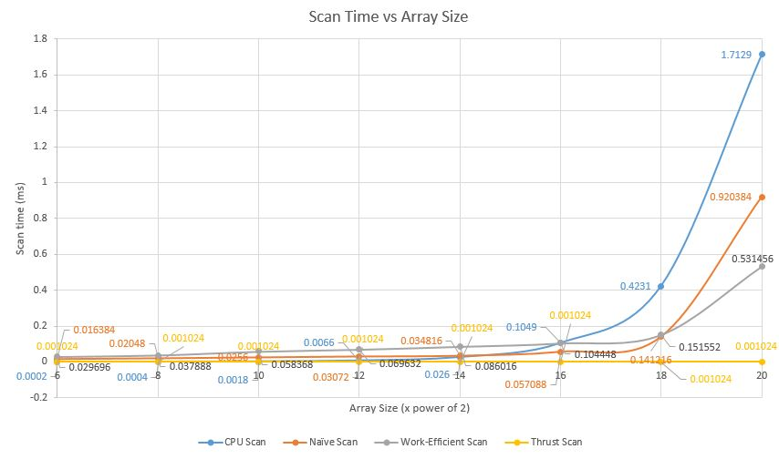

CUDA Stream Compaction
======================

**University of Pennsylvania, CIS 565: GPU Programming and Architecture, Project 2**

* Wanru Zhao
  * [LinkedIn](www.linkedin.com/in/wanru-zhao).
* Tested on: Windows 10, Intel(R) Xeon(R) CPU E5-1630 v4 @ 3.70GHz, GTX 1070 (SIG Lab)

### Features

 - CPU Scan & Stream Compaction
 - Naive GPU Scan Algorithm
 - Work-Efficient GPU Scan
 - Work-Efficient GPU Stream Compaction
 - Thrust Implementation
 
### Extra Credits

- Work-Efficient GPU Scan Optimization: by reducing empty or rest threads, dynamically lauch kernal
- Radix Sort

### Performance Analysis
#### Block size over GPU scan methods (Array size 256)


Performed analysis of blocksize impact over Naive Scan(power of two/non-power of two) and work-efficient scan(power of two/non-power of two). It shows that given the same block size, work-efficient GPU scan will be always better than Naive scan. And the size of array, whether is power of two or not, has little impact on one implementation of same block size. And from the graph, the performance has little change over the block size. The rough optimal blocksize is 512 for each implementation.

#### Array size over scan methods (Block size 1024)



From this graph, we can find, thrust scan has the best performance over changes of array size, and it keeps the same for 2^6 to 2^20 numbers. And as array size raises, CPU scan's performance decreases dramatically. And Naive is better than CPU, but worse than work-efficient scan. When array size is between 2^6 to 2^14, CPU method is better than two GPU scan methods, and when array size is between 2^14 to 2^16, work-efficient is better than CPU, and when array size is larger than 2^16, Naive becomes better than CPU.
Thrust methods may optimized memory allocation and accessing methods and how it devides the block to make the performance stable and best.

#### Array size over compaction methods (Block size 1024)


We can see from the graph that, CPU method with scan is the worst, since for compaction, it actually does O(n) for finding booleans, O(n) for doing the scan and O(n) for scattering, since simple compaction just needs O(n) time. And when array size is large enough, work-efficient compaction benefits from its parallism and performs the best.

#### Radix Sort (Block size 1024, Array size 256)

Time: 1.52576ms

### Result
```
****************
** SCAN TESTS **
****************
    [  18  22  20  42  10  18  23   8  38   0  30  27   2 ...  27   0 ]
==== cpu scan, power-of-two ====
   elapsed time: 0.0011ms    (std::chrono Measured)
    [   0  18  40  60 102 112 130 153 161 199 199 229 256 ... 6238 6265 ]
==== cpu scan, non-power-of-two ====
   elapsed time: 0.0008ms    (std::chrono Measured)
    [   0  18  40  60 102 112 130 153 161 199 199 229 256 ... 6157 6161 ]
    passed
==== naive scan, power-of-two ====
   elapsed time: 0.036864ms    (CUDA Measured)
    passed
==== naive scan, non-power-of-two ====
   elapsed time: 0.036864ms    (CUDA Measured)
    passed
==== work-efficient scan, power-of-two ====
   elapsed time: 0.070656ms    (CUDA Measured)
    passed
==== work-efficient scan, non-power-of-two ====
   elapsed time: 0.068608ms    (CUDA Measured)
    passed
==== thrust scan, power-of-two ====
   elapsed time: 0.001024ms    (CUDA Measured)
    passed
==== thrust scan, non-power-of-two ====
   elapsed time: 0.001024ms    (CUDA Measured)
    passed
    [  18  22  20  42  10  18  23   8  38   0  30  27   2 ...  27  35 ]
==== radix sort, power-of-two ====
   elapsed time: 1.52883ms    (CUDA Measured)
    [   0   0   0   1   1   1   1   2   2   2   2   2   2 ...  49  49 ]
    passed
==== radix sort, non-power-of-two ====
   elapsed time: 1.52576ms    (CUDA Measured)
    [   0   0   0   1   1   1   1   2   2   2   2   2   2 ...  49  49 ]
    passed

*****************************
** STREAM COMPACTION TESTS **
*****************************
    [   0   2   2   0   0   0   3   0   2   2   2   1   0 ...   1   0 ]
==== cpu compact without scan, power-of-two ====
   elapsed time: 0.0015ms    (std::chrono Measured)
    [   2   2   3   2   2   2   1   1   3   1   3   1   1 ...   1   1 ]
    passed
==== cpu compact without scan, non-power-of-two ====
   elapsed time: 0.0015ms    (std::chrono Measured)
    [   2   2   3   2   2   2   1   1   3   1   3   1   1 ...   3   1 ]
    passed
==== cpu compact with scan ====
   elapsed time: 0.0062ms    (std::chrono Measured)
    [   2   2   3   2   2   2   1   1   3   1   3   1   1 ...   1   1 ]
    passed
==== work-efficient compact, power-of-two ====
   elapsed time: 0.09216ms    (CUDA Measured)
    passed
==== work-efficient compact, non-power-of-two ====
   elapsed time: 0.090112ms    (CUDA Measured)
    passed
```
